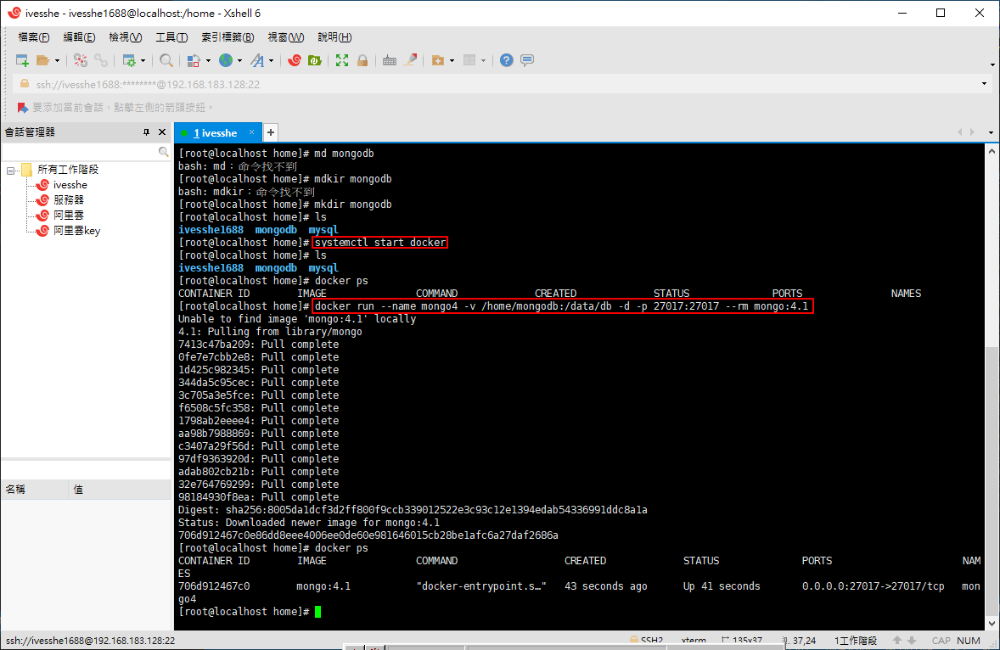

# Nodejs_Express
練習
- express
- ejs
- mongodb

# 參考文檔
https://www.npmjs.com/

# 安裝Express

```shell
npm install express --save
```

# 執行畫面


# 安裝ejs

```shell
npm install ejs --save
```


# 安裝supervisor

可以隨時監看程式是否更新，自動重啟服務器，不然每次修改完都手動重啟

```shell
npm install supervisor -g
```

```shell
# 安裝好之後，以該指令啟動，即會有監聽程式變動重啟的效果
supervisor app.js
````


# 安裝body-parser

可以隨時監看程式是否更新，自動重啟服務器，不然每次修改完都手動重啟

```shell
npm install body-parser --save
```


# 安裝cookie-parser

```shell
npm install cookie-parser --save
```


# 修改hots


測試可以使用


# 多個域名共享cookie

```js
 // 多個域名共享cookie , bbb.ivesshe.com:3000 , aaa.ivesshe.com:3000
    res.cookie("username","ivesshe888",{maxAge:1000*60*60,domain:".ivesshe.com"});
```


非該域名，訪問不到了


# cookie加密

```js
// 配置cookieParser中間件，中間是密碼
app.use(cookieParser("ivesshe104"));
```

```js
// cookie的加密
res.cookie("username","ivesshe888",{maxAge:1000*60*60,signed:true});

// 獲取加密的cookie
app.get("/product",(req,res)=>{    
    let username = req.signedCookies.username;
    console.log("product--"+username);
    res.send("product--"+username);
})
```


非使用加密的取法，取不到資料


# 安裝express-session

```shell
npm install express-session --save
```


第一次使用，尚未登錄


已登錄


再次查看，已登錄了


已登出，session被刪掉了


# 使用Docker安裝MongoDB，練習使用

先啟動docker

```shell
systemctl start docker
```

安裝並執行MongoDB

```shell
docker run --name mongo4 -v /home/mongodb:/data/db -d -p 27017:27017 --rm mongo:4.1
```



進入mongodb容器

```shell
docker exec -it 706d912467c0 /bin/bash
```

```shell
mongodb
```


建立shop資料庫

```shell
show dbs

# 切換資料庫(未存在的也可以切換，但要插入資料之後，才會直的建立)
use shop

# 插入一筆資料
db.tablea.insert({"name":"ivesshe"})

# 再次查看shop建立了
show dbs

# 查看表
show collections
```

shop建立完成，繼續回node.js寫code


# 負載均衡配置session，把session保存到數據庫裡

安裝connect-mongo

```shell
npm i connect-mongo --save
```


# 這裡連結MongoDB有出問題，不知道何node.js連不上docker

# 路由模塊化

將一些路由功能拆出個別js檔案，方便管理

也方便多人撰寫，每個人可以負責不同的api功能區塊


# 另一種模塊化的方式，使用框架生成項目

只筆記，但不操作

安裝
```shell
npm install -g express-generator
```

查看命令
```shell
express -h
```

生成項目
```shell
# express --view=ejs 應用的名稱
# ex
express --view=ejs myApp

# 生成完之後，安裝所需要的依賴
npm i
```

[參考文檔](https://www.expressjs.com.cn/starter/generator.html)


